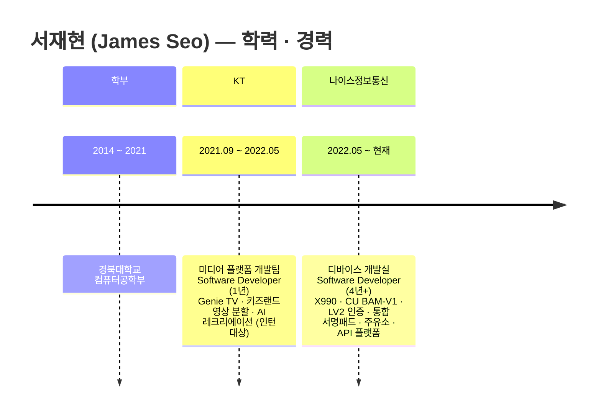

# 서재현 (James Seo) — 포트폴리오

> **Android Device Developer · Software Developer**
> 4년+ 핀테크 결제 단말기 · Modern Android · Linux 임베디드

<div align="center">
  
</div>

---

## 📑 목차

1. [프로필 · 이력](#1-프로필--이력)
2. [자기소개서](#2-자기소개서)
3. [경력 타임라인](#3-경력-타임라인)
4. [프로젝트 상세](#4-프로젝트-상세)

---

---

# 1. 프로필 · 이력

## Contact

| | |
|---|---|
| 📧 Email | ajpuop@naver.com |
| 📱 Phone | +82-10-9888-5478 |
| 🐙 GitHub | [@hyummys](https://github.com/hyummys) |
| 💼 LinkedIn | [hyummy9james](https://www.linkedin.com/in/hyummy9james) |
| 🌐 Portfolio | [hyummys.github.io](https://hyummys.github.io) |

## 학력

| 기간                | 학교        | 학과 |
|-------------------|-----------|---|
| 2014.03 – 2021.08 | **경북대학교** | 컴퓨터공학부 |

## 경력

| 기간                     | 회사 | 부서 / 직책                          |
|------------------------|---|----------------------------------|
| **2022.05 – 현재** (4년+) | **나이스정보통신** | 디바이스 개발실 · Software Developer    |
| 2021.09 – 2022.05 (1년) | **KT** | 미디어 플랫폼 개발팀 · Software Developer |

## 한 줄 요약

> 핀테크 결제 단말기 도메인에서 4년 이상의 깊이 있는 경험을 쌓은 **Android · 임베디드 디바이스 개발자**. Kotlin/Compose 기반 차세대 결제 단말기부터 C/C++ Linux 임베디드까지, 하드웨어와 소프트웨어를 잇는 복합 역량 보유. **단독 개발로 5개+ 전국 상용 서비스 런칭**.

---

---

# 2. 자기소개서

> **"하드웨어와 소프트웨어를 함께 다루며, 상용 서비스 출시 및 운영 경험이 풍부한 끝까지 책임지는 개발자"**

## 한 줄 요약

핀테크 결제 단말기 도메인에서 **4년 이상의 깊이 있는 경험**을 쌓은 Android · 임베디드 디바이스 개발자입니다. **Kotlin + Jetpack Compose 기반 차세대 결제 단말기**부터 **C/C++ Linux 임베디드 시스템**까지, 하드웨어와 소프트웨어를 잇는 복합 역량을 보유하고 있으며, **메인 개발 담당으로 CU,GS칼텍스,E1, H&M, 롯데호텔 등 10개이상의 전국 대형법인 결제 서비스**를 런칭하며 설계부터 운영까지 제품의 전 생명주기를 책임져 왔습니다.

## 핵심 강점

### 1. 핀테크 도메인 전문성 (4년+)
- 나이스정보통신 디바이스 개발실에서 **EMV Contactless Level 2 (Mastercard/ VISA)** 등 글로벌 인증을 직접 획득
- **NICE · KIS · NPG 다중 VAN사 통합** 경험으로 결제 도메인 깊이 확보
- **BGF리테일(CU 편의점), E1 · GS칼텍스, H&M**(2026.06 도입 예정) 등 실제 사용자가 매일 거치는 결제 단말기 메인 기획/개발

### 2. Modern Android + 임베디드 복합 역량
- **Kotlin + Jetpack Compose + Hilt + Coroutines/Flow** 기반 차세대 결제 단말기(X990) 0부터 단독 설계
- **NDK/JNI · BLE GATT · Serial 멀티 포트 · AIDL 70개 HW 인터페이스** 통합 경험
- **C/C++ Linux 임베디드**부터 **AOSP 셋톱박스(KT Genie TV)**까지, 디바이스 OS 레벨의 작업에 익숙

### 3. 단독으로 끝까지 책임지는 개발 태도
- 사내에 LINUX 펌웨어와 Android 앱을 모두 다룰 수 있는 유일한 인력으로, **설계 · 개발 · CS · 현장 대응까지 전 과정 단독 수행 경험**
- 회사 최초 사례를 여러 번 만든 경험: **회사 최초 자체 설계 Android 결제 단말기(CU), 회사 최초 다중 VAN 통합 서명패드**
- 단순히 "코드를 짠다"가 아니라 **기획서 · 화면명세서 · 아키텍처 · 디자인 결정 · 운영 인프라까지** 책임지는 작업 방식

### 4. 정량적 성과로 증명된 실력
- **17,000% 다운로드 효율 개선** — XModem + C타입 가상 시리얼 활용으로 2시간 40분 → 40초
- **앱 응답 속도 30% 개선** — HW 가속 활용
- **코드 재사용률 89.8% → 95%** — 제조사 비종속 코드 비율
- **개발 효율 300% 향상** — 단일 소스 멀티 디바이스 플랫폼
- **CU 편의점 매월 500대+ 배포 후 멈춤 이슈 0건**, 출시 후 6개월간 민원 1건

### 5. 빠른 학습과 도메인 확장
- KT 근무 당시 **영상 처리(FFmpeg/OpenCV) + 머신러닝(K-means/DBSCAN)**으로 키즈랜드 동화 자동 페이지 분할 시스템을 단독 기획·개발해 상용화
- 이 경험이 이후 NICE 결제 단말기의 **ExoPlayer 광고 미디어 시스템(H.264 HW 가속)** 설계로 자연스럽게 연결
- **AOSP 실 산업 환경**을 KT에서 다뤄 본 경험이 NICE 결제 단말기 **AIDL 기반 HW 제어** 설계의 토대가 됨

## 일하는 방식

- **변경에 열린 설계** — 운영 중 새로 발견된 요구사항도 기존 구조를 깨지 않고 흡수할 수 있도록 처음부터 모듈화·추상화를 의도적으로 적용합니다.
- **시행착오를 두려워하지 않음** — 초기 접근이 안 통하면 즉시 가설을 바꿉니다. (X990 자체 암호화 모듈 전환, CU 전문 처리 위치 재설계, Kotlin 100% 전략 포기 후 NDK 분리 등)
- **현장이 답** — 운영 중 발견되는 진짜 이슈는 책상에서 안 보입니다. CS·현장 테스트를 직접 다니며 얻은 인사이트를 다음 설계에 반영합니다.
- **민원이 안 나오는 게 최고의 품질** — 결제 단말기는 1분 멈춤이 곧 손실. 안정성을 최우선에 두고 보수적으로 설계합니다.

## 지향점

Android 디바이스 개발 영역에서 **사용자가 매일 신뢰하고 쓰는 디바이스**를 만들고 싶습니다. 결제 단말기 도메인에서 쌓은 "절대 멈추면 안 되는" 안정성 감각과, 0에서 시작해 상용화까지 책임지는 풀사이클 경험을 살려, 더 큰 사용자 임팩트를 만드는 팀에 기여하고 싶습니다.

---

---

# 3. 경력 타임라인

## 시각 타임라인 (Mermaid)



## 시각 타임라인 (ASCII · Mermaid 미지원 환경 대비)

```
  2014                       2021    2022                            2026 (현재)
   │                          │       │                                │
   ├──── 경북대학교 컴퓨터공학부 ────┤       │                                │
   │       (7년 6개월)             │       │                                │
   │                          │       │                                │
   │                          ├─ KT ──┤                                │
   │                          │ (1년) │                                │
   │                                                                   │
   │                                  ├──────── 나이스정보통신 ──────────┤
   │                                  │             (4년+)             │
   │                                  │        디바이스 개발실           │
   ▼                                  ▼                                ▼
```

## 회사별 핵심 활동

### 🟦 KT · 미디어 플랫폼 개발팀
**2021.09 ~ 2022.05** (1년)

- **기가지니 Android TV 전환 프로젝트** — 메인 화면 · 키즈 컨텐츠 플랫폼 담당. Genie TV 2022 상반기 런칭. 전국 56% 점유.
- **키즈랜드 동화 자동 페이지 분할 시스템** — Python · FFmpeg · OpenCV · K-means · DBSCAN 단독 기획·개발. 50편+ 동화 콘텐츠 100% 정확도 자동 분할 상용화.
- **AI 레크리에이션 플랫폼** — 인턴 공모전 **대상 수상**.

### 🟧 나이스정보통신 · 디바이스 개발실
**2022.05 ~ 현재** (4년+)

- **차세대 Android 결제 단말기 X990** — Kotlin/Compose, 단독 설계, H&M 매장 도입 예정.
- **BGF리테일 CU Android 결제 단말기 BAM-V1** — 전국 4,000대+ 상용 운영, 일 10만 건+.
- **Mastercard / VISA RF LV2 컨택리스 인증** — 사내 EMV 노하우 0에서 8개월 만에 두 브랜드 모두 획득.
- **Linux 기반 다중 VAN 통합 서명패드** — 회사 최초 사례, MLB · 내셔널지오그래픽 매장 사용.
- **Linux API 결제 단말기 플랫폼** — NICE 메인 단말기 플랫폼 채택, 50+ 법인 파생.
- **E1 · GS칼텍스 주유소 무선 결제 단말기** — 전국 배포, 일 30만 건+.

---

---

# 4. 프로젝트 상세

회사 프로젝트를 **STAR 형식**(Situation · Task · Action · Result)으로 정리.

## 1. 차세대 Android 결제 단말기 (X990 CAT)

**회사 · 기간**: 나이스정보통신 · 약 9개월 단독 개발
**역할**: 단독 기획·설계·개발 (메인 개발자 / PM 겸직) · 서브 개발자 2명 + 사내 디자이너 1명 협업
**기술 스택**: `Kotlin 2.0` · `Jetpack Compose` · `Material 3` · `MVVM` · `Hilt` · `Coroutines/Flow` · `Retrofit` · `Room` · `AIDL (70개)` · `NDK` · `SEED 암호화` · `TMS` · `TRS` · `OCR` · `PCI DSS` · `JUnit` · `Mockk`
**규모**: 469커밋 · Kotlin 193 파일 · 8 모듈 · 8 ViewModel

### S — Situation
NICE의 기존 결제 단말기는 모두 **Linux 기반**으로 결제 외 기능 확장에 큰 제약이 있었음(광고·사용자 친화적 UI·설정 확인 등). 글로벌하게 결제 시장이 **Android 생태계로 이동**하고, 풀터치 스크린 기반의 광고·관리·친숙한 UX 수요가 증가하면서 회사 차원의 차세대 단말기 전환이 시급한 상황. 그러나 회사는 Android 결제 단말기 개발 경험·레퍼런스가 전무했고, **6개월(파생 포함 9개월) 내 첫 Android 단말기 출시**라는 일정 압박.

### T — Task
앱 구조·통신 구조·기술 스택이 **0인 상태**에서 단독으로 기획서·화면명세서부터 작성하고 전체 아키텍처·통신·확장성을 설계. **6개월 내 출시 + 시큐어 장비 인증 획득**을 동시에 달성. 아키텍처·디자인·동작 플로우의 모든 결정권을 가지고 처음부터 끝까지 책임.

### A — Action
- **Modern Android 스택 채택** — 처음부터 Jetpack Compose + Hilt + Coroutines/Flow + MVVM 기반 설계. HW 제어가 중심인 단말기 특성상 네이티브 언어(Kotlin/NDK)로 일관성 확보.
- **8개 모듈로 의도적 분리** — App · Feature(UI) · HW · Payment · Data · DI · Service · ViewModel로 책임을 분리해 결제 앱 특유의 반복 패턴에 일관성과 유지보수성 부여.
- **AIDL 70개 HW 인터페이스 통합** — EMV, 암호화, 스캐너, IC/RF/MSR 카드리더 바인딩. 가장 까다로웠던 부분은 **충전 크래들과의 무선 Serial 통신** 구조 (전원·시리얼·무선이 동시에 얽힌 구조 이해와 안정화).
- **[시행착오] 자체 암호화 모듈로 전환** — 초기에는 제조사 NDK의 암호화·민감 데이터 처리를 그대로 사용했으나 통신 스펙 커스터마이징 한계 발견 → Kotlin/NDK로 **RLE 압축, 키 저장, 키 암호화 등 결제 승인 보안 로직 직접 재구현**.
- **OCR·TRS 별도 모듈화** — 면세/외국인 환급용 특수 기능을 기존 결제 플로우에 끼워넣지 않고 독립 모듈로 분리해 재사용성·유지보수성 확보.
- **SW 자체 쓰로틀링 알고리즘** — 다중 HW 병렬 제어로 발생한 발열·랙 이슈를 SW 레벨에서 직접 해결.

### R — Result
- **상용화 출시 완료** — 일반형 X990 결제 단말기 + **글로벌 패션 브랜드 H&M 매장 도입 예정(2026.06~)** + TRS 기능 출시 예정(2026.06).
- **코드 재사용률 89.8% → 95%** — 제조사 비종속 코드 비율. 타 제조사 디바이스로 즉시 이식 가능한 구조.
- **출시 후 CS 인입 거의 없음** — 즉시 강제 업데이트 + 사용자 지정 시간 자동 버전 체크 시스템.
- **사업 확장 가능성** — 여권 OCR + 무선 POS 연동 덕분에 다양한 TRS 판매처·무선 POS 가맹점에서 긍정적 검토 중.
- **본인 성장** — Android 앱 전반 설계 역량, 제조사 SDK 분석·HW 제어 역량, 결제 도메인 지식(포인트/TRS/POS 연동) 습득.

---

## 2. BGF리테일 CU Android 결제 단말기 (BAM-V1)

**회사 · 기간**: 나이스정보통신
**역할**: 단독 개발 (설계 · 개발 · CS) — Android 앱 + LINUX 펌웨어 양쪽을 모두 다룰 수 있는 유일한 인력으로 PoC부터 현장 운영까지 책임
**기술 스택**: `Kotlin` · `Jetpack Compose` · `MVVM` · `Coroutines/Flow` · `NDK/JNI` · `C++ (XModem)` · `BLE GATT` · `Serial 통신` · `SEED 암호화` · `ExoPlayer` · `HW 가속` · `핸들러 레지스트리 패턴`
**규모**: 344커밋 · Kotlin 99 파일 · C++ 네이티브 코드 포함

### S — Situation
전국 1위 편의점 체인 **CU(BGF리테일)**가 기존 Linux 기반 결제 단말기를 Android 기반으로 교체하는 시점. 시장에서는 TOSS·NAVER가 자체 Android 결제 단말기로 점유율을 빠르게 가져가는 상황이었고, **NICE도 자체 Android 결제 단말기 출시가 사업적으로 시급**. BGF의 핵심 요구는 결제 속도 · 다양한 결제 수단 호환성(유선 Serial + 무선 BLE) · Android 관리·업데이트·원격 제어·광고 기능. 특히 **폐쇄망 점포에서 인터넷 없이 Serial 통신만으로 100MB+ 앱 업데이트** 제약. NICE가 Android 결제 단말기를 자체 설계해 공급하는 **첫 번째 사례**.

### T — Task
구조·동작 방식 모두 **0인 상태에서 단독으로 처음부터 설계**. 사내에 LINUX 펌웨어 인력과 Android 앱 인력이 따로 있었으나, **둘 다 다룰 수 있는 사람은 본인 뿐**이어서 설계·개발·운영·현장 CS까지 전 과정 책임. 가장 큰 도전은 **24시간 365일 무중단 운영 품질** — 결제 단말기는 1분이라도 멈추면 결제 손실 발생.

### A — Action
- **핸들러 레지스트리 패턴 채택** — 11개 전문 핸들러로 결제 커맨드 분리. 비슷한 구조에 인자만 다른 기능이 계속 추가될 것을 예상해 Strategy 패턴 대신 레지스트리로 확장성·유지보수성 우선.
- **4 Serial + BLE GATT + USB 멀티 프로토콜** — 4개 Serial 포트가 각각 독립 I/O 스레드 + 4가지 전문 파싱 로직으로 동작. 사실상 4개의 다른 기능을 동시에 안 꼬이게 개별 처리하는 구조 설계가 가장 까다로움.
- **Serial → BLE 자동 페일오버** — POS 비정상 동작·통신 장애 시 모바일 POS 앱과 BLE로 연결해 결제 가능하게 한 비상 결제 기능. **실제 반년 동안 4건의 POS 오류 상황에서 발동되어 결제 손실을 막음**.
- **발열 디버깅 (가설→검증)** — 에이징 테스트 모니터링으로 특정 동작에서만 발열 확인 → 프로세스별 CPU 점유율 분석 → CPU 렌더링 필수/비필수 분리 → 대체 가능한 부분 모두 SoC HW 가속으로 이전.
- **XModem 속도 한계 돌파** — 기존 POS 연동 프로토콜이 모두 .so로 묶여 있어 NDK/JNI(C) 기반으로 통합. **C타입 포트를 가상 시리얼 포트로 활용**해 XModem 프로토콜의 물리적 속도 한계 우회.
- **[시행착오 1] 전문 처리 위치 변경** — 처음엔 모든 데이터 전문 처리를 IFM(리더기 프로세서)에서 하려 했으나 **2중 통신으로 타이밍 이슈와 화면 처리 꼬임 발생**. App에서 상호인증·무결성 검증을 처리하고 IFM은 카드 리딩·암호화 등 보안 정보만 담당하는 구조로 재설계.
- **[시행착오 2] Kotlin 100% 전략 포기** — 모든 기능을 Kotlin으로 가려 했으나 속도·보안 이슈로 카드 리딩 로직과 HW 제어 상태 관리는 NDK로 분리.

### R — Result
- **4,000대 이상 전국 CU 편의점 상용 운영**, 일평균 **10만 건 이상 거래 처리**.
- **응답 지연 50% 개선** (200~500ms → 100~300ms), **앱 응답 속도 30% 개선** (HW 가속).
- **업데이트 다운로드 효율 17,000% 개선** — 원래 XModem으로 2시간 40분 걸리던 100MB 다운로드를 **40초대로 단축** (C타입 가상 시리얼 활용).
- **발열 완전 해결** — 내부 CPU 62℃ → 50℃, 외부 스크린 40℃ → 34℃. 24/7 무중단 운영 환경에서도 안정성 확보.
- **출시 후 6개월간 민원 1건** — 원격 모니터링 시스템으로 즉시 분석·조치 가능. **3,000대 이상 배포 후 멈춤 이슈 0건**.
- **본인 성장** — 대규모 프로젝트 코드 베이스 설계 역량 + 운영 중 발견한 문제를 기존 구조를 깨지 않고 흡수하는 "변경에 열린" 설계 감각.

---

## 3. Mastercard / VISA RF LV2 컨택리스 인증 내재화

**회사 · 기간**: 나이스정보통신 · 약 8개월 (Mastercard, VISA 각각)
**역할**: Contactless 에뮬레이터 개발 + RF LV2 브랜드사 테스트 프로그램 검증
**기술 스택**: `Python` · `PyQt5` · `EMV Level 2` · `ISO 14443 Type A/B` · `NFC/RF` · `Card Emulator`

### S — Situation
회사 차원에서 글로벌 카드 브랜드사의 **RF 컨택리스 결제 인증을 내재화**하기로 결정. 그러나 **사내 EMV 노하우는 전무**했고, 이전에 인증 시도 이력도 없는 0의 상태. 인증 주체는 EMV 북에 따른 **자체 테스트 에뮬레이터를 반드시 보유**해야 하며, 각 회사의 자산이라 외부에서 솔루션을 제공받을 수 없는 영역. "직접 만들지 않으면 인증을 못 받는" 구조.

### T — Task
**Mastercard · VISA 각 8개월의 인증 일정** 안에서 Contactless 에뮬레이터 개발 + RF LV2 브랜드사 테스트 프로그램 검증까지 완료. 인증 진행 일정까지 포함된 기한이라 **실 개발 가능 기간은 반년도 채 되지 않음**.

### A — Action
- **PyQt5 기반 카드 테스터 에뮬레이터 자체 개발 (Mastercard)** — 외부 솔루션 부재로 EMV 북 사양에 맞춰 처음부터 직접 구현.
- **VISA 인증용 단말기 앱 + 카드 에뮬레이터 통합 개발** — 두 브랜드의 서로 다른 사양을 모두 수용.
- **[가장 까다로웠던 부분] 동일 태그·상황별 분기 처리** — 같은 EMV Tag라도 상황에 따라 응답이 달라져야 하므로, 에뮬레이터가 상황 별로 판단해 각기 다른 응답을 내도록 설계.
- **사전 검증 프로그램으로 인증 비용 최소화** — Function Test / Performance Test 등 단계별 인증 절차에서 한 번 Fail이 나면 **400건+ 전체 테스트 케이스를 재실행**해야 함. 이를 막기 위해 실 인증기관 테스트 전에 자체 검증할 수 있는 사전 검증 프로그램을 만들어 통과 후 인증 진행.

### R — Result
- **Mastercard · VISA 공식 LV2 인증 획득** — 사내 EMV 노하우 0인 상태에서 8개월 일정 안에 두 브랜드 모두 통과.
- **회사 사업 영역 확장** — 애플페이·NFC 결제 등 RF 결제가 시장에서 필수가 된 시점에 자체 RF 리더 탑재 단말기 출시 가능.
- **인증 모듈 재사용으로 인증 비용 절감** — GS칼텍스 주유소 무선 단말기로 처음 인증받은 모듈을 **이후 출시되는 자체 단말기 리더기에 모두 탑재**해, 단말 출시마다 들어가던 RF 인증 비용을 지속 절감.
- **본인 성장** — EMV 컨택리스 표준·ISO 14443·RF 프로토콜 전반 도메인 지식 확보. 이후 X990·CU 자체 Android 결제 단말기 보안 모듈 설계의 토대.

---

## 4. Linux 기반 다중 VAN 통합 서명패드

**회사 · 기간**: 나이스정보통신
**역할**: 단독 기획·설계·개발·검증 — 회사 최초 다중 VAN 통합 서명패드
**기술 스택**: `C/C++` · `Linux Embedded` · `NFC/RF` · `EMV IC` · `바코드` · `Serial 통신` · `멀티 VAN 통합`

### S — Situation
그동안 시장에는 **각 VAN사 전용 서명패드만 존재**했고, 여러 VAN사의 통신 전문을 모두 수용해 일관되게 동작하는 통합 서명패드는 없었음. VAN사별로 서로 다른 통신 스펙을 하나의 코드베이스에서 안정적으로 동작시키는 것이 기술적으로 까다로워서였음. 마침 **NICE정보통신 / NICE페이먼츠 / KIS정보통신 3사 합병 이슈**가 부상하면서 3사 합작 결제 단말기가 생길 수 있는 상황 — VAN사 구애받지 않는 **통합 서명패드의 시장 필요성이 빠르게 커진 시점**.

### T — Task
각 VAN사의 통신 전문을 분석·파싱하고, 이를 하나의 통합 동작 로직으로 묶는 설계·개발을 **단독으로 모두 책임**. NICE · KIS · NPG · 통합 스펙 **4개 VAN 사양**을 하나의 코드베이스에서 일관되게 동작시키는 것이 핵심.

### A — Action
- **Serial 패킷 단위 분석 → VAN 식별 → 통합 로직 매칭** — Serial 리딩 단에서 packet 단위로 데이터를 받아 byte 단위로 분석. 어떤 VAN사 전문인지를 먼저 판정한 뒤, 기능 단위로 통합 전문 로직에 매칭해 일관되게 동작하도록 설계.
- **VAN 자동 감지 — 전문 헤더 구조 기반 식별** — 별도 협상 없이 각 VAN사의 전문 헤더 구조를 분석해 자동 식별하는 로직 구현.
- **NFC / 바코드 / EMV IC 통합** — 결제 입력 수단도 RF(NFC), 바코드 스캐너, EMV IC 카드를 하나의 디바이스에서 모두 수용.
- **Linux 임베디드 환경 최적화** — 하드웨어 드라이버 최적화, 메모리 관리, 통신 암호화·거래 데이터 보안 처리까지 모두 직접 처리.

### R — Result
- **회사 최초 다중 VAN 통합 서명패드 상용화** — NICE · KIS · NPG · 통합 4개 스펙 모두 지원.
- **실제 의류 업체 도입 운영 중** — MLB · 내셔널지오그래픽 등 의류 브랜드 매장에서 사용 중.
- **회사 차원의 신규 시장 개척** — 그동안 VAN사 종속이라 진입할 수 없었던 **통합 멀티패드 시장을 열음**.
- **본인 성장** — 서로 다른 통신 스펙을 추상화해 하나의 일관된 로직으로 묶는 설계 감각 — 이후 X990·CU 단말기의 멀티 프로토콜 통합 설계에 그대로 적용된 핵심 역량.

---

## 5. Linux 기반 API 결제 단말기 플랫폼

**회사 · 기간**: 나이스정보통신
**역할**: 무선/유선 단말기 개발 및 유지보수, 법인 전용 버전 12개 단독 개발 — NICE 메인 단말기 플랫폼으로 채택
**기술 스택**: `C/C++` · `Linux Embedded` · `EMV Level 2` · `WiFi/LTE` · `Ethernet/Serial` · `전처리 빌드 분기`

### S — Situation
제조사·유선·무선 단말기 종류별로 **소스가 모두 분리되어 있고, 수정 시기도 제각각**이라 공통 적용이 필요한 로직을 일괄 반영하기가 어려운 상황. 신규 법인 서비스가 들어올 때마다 동일한 작업을 디바이스 수만큼 반복하는 비효율 누적.

### T — Task
단일 소스 기반으로 **6개 기종을 동시에 지원하는 결제 단말기 플랫폼**을 구축하고, 무선·유선 단말기 개발 및 유지보수, 그리고 **법인 전용 버전 12개를 단독으로 개발**.

### A — Action
- **전처리 빌드 분기 기반 단일 소스 전략** — 디바이스마다 정말로 달라야 하는 부분만 빌드 시점 분기로 처리하고, 나머지 공통 로직은 모두 하나의 소스에서 공유. 별도 라이브러리 도입 없이도 6개 기종 일괄 빌드가 가능한 구조 확보.
- **6개 기종 공통 로직 추상화** — 하드웨어 종속성을 분리해 결제 로직을 디바이스 독립적으로 구현. 신규 디바이스 추가 시 분기 포인트만 채우면 동작.
- **유·무선 통신 통합** — WiFi · LTE · Ethernet · Serial을 한 플랫폼에서 모두 처리. EMV Level 2 인증 기반 IC카드 결제 통합.

### R — Result
- **NICE 메인 단말기 플랫폼으로 채택** — 회사에서 가장 메인으로 미는 단말기들의 결제 로직이 모두 이 플랫폼에 통합. 사용자는 환경에 따라 다른 디바이스를 사용해도 동일한 로직으로 결제 가능.
- **개발 효율 약 3배 향상** — 신규 법인 서비스 요청 시 **6종 단말기에 일괄 공통 적용 가능**.
- **50개+ 법인 전용 파생 제품 지원** — 하나의 플랫폼 위에서 법인 맞춤 버전을 빠르게 파생.

---

## 6. 주유소 전용 무선 결제 단말기 (E1, GS칼텍스)

**회사 · 기간**: 나이스정보통신
**역할**: 단독 설계·개발·현장 테스트
**기술 스택**: `C/C++` · `Linux Embedded` · `4G/WiFi` · `POS 연동` · `다단계 트랜잭션` · `망상 취소`

### S — Situation
주유소 결제는 일반 결제와 구조가 다름 — 쿠폰·포인트·유류 할인·이벤트 할인·카드 할인 등 **VAN에서 자체적으로 조회하고 할인 처리해야 하는 로직**이 필수. 게다가 한 건의 결제가 **서버와의 2~3회 transaction**으로 이루어지는 다단계 구조. 국내 주유소 시장은 SK · S-Oil · GS칼텍스 · E1 · 현대오일뱅크 등 **주요 주유소가 모두 NICE 사용** — 24시간 운영 환경의 안정성과 즉시 대응 역량이 핵심 신뢰 기준.

### T — Task
**단독으로 설계·개발·현장 테스트까지 책임**. 주유소는 거래 건수가 많고 단건 금액도 커서 **실수 한 건이 큰 민원으로 직결** — "민원이 최대한 발생하지 않도록 만드는 것"이 최우선.

### A — Action
- **다단계 트랜잭션 설계 — 프리셋 → 주유 → 결제** — 한 결제 흐름을 여러 transaction으로 안전하게 진행하고, 중간 실패 시 **망상 취소**로 깨끗하게 롤백한 뒤 처음부터 재진행하도록 복구 로직 구현.
- **현장 테스트로 발견된 이벤트 미수신 이슈 대응** — 실 주유소 환경에서 이벤트 업데이트를 제때 못 받으면 할인금액이 의도와 다르게 결제되는 사례 발견. 이런 케이스에 대한 **예외 처리를 폭넓게 적용**해 잘못된 할인 결제를 차단.
- **4G/WiFi 무선 통신 + POS 연동** — 무선 환경에서 실시간 승인 시스템 구축, 주유기 POS와의 유량 데이터 동기화.
- **주유소 환경 특화 최적화** — 방폭·온도·진동 등 일반 결제 환경과 다른 까다로운 물리적 조건 대응.

### R — Result
- **E1, GS칼텍스 전국 주유소 배포 완료**, 현재 운영 중.
- **일평균 30만 건 이상 거래 처리** — 단건 금액이 큰 실 거래 규모에서 안정적으로 동작.
- **본인 성장** — 다단계 트랜잭션의 실패 복구 설계, 무선 환경에서 결제 무결성을 보장하는 설계 경험. "민원이 발생하지 않게 만드는" 보수적·안전 우선 설계 감각 체화.

---

## 7. 기가지니 Android TV 전환 프로젝트 (Genie TV)

**회사 · 기간**: KT · 2021.09 ~ 2022.05 (1년)
**역할**: 메인 화면 + 키즈 컨텐츠 플랫폼 개발자 — 모든 사용자가 가장 처음 보는 진입 화면 담당 · 10명 × 6팀 본부 구조
**기술 스택**: `Android TV (AOSP)` · `Kotlin` · `MVVM` · `MVP` · `Leanback Library` · `RESTful API` · `WebSocket`

### S — Situation
OTT 중심으로 미디어 시장이 빠르게 재편되며, KT의 **기존 Web 뷰 기반 셋톱박스로는 콘텐츠 생태계 확장이 어려워진 상황**. 글로벌 트렌드도 Android TV로 이동. 0부터 시작하는 대규모 전환 프로젝트로, **Android로 설계되지 않은 기존 디바이스(Linux 기반)에 AOSP를 포팅**하고, 기존 리모컨 UX를 그대로 유지하면서 OS와 UI 전체를 갈아끼우는 작업. 셋톱박스 특성상 **24/7 운영 환경 + OTA 업데이트 안정성**까지 함께 보장.

### T — Task
본인은 **메인 화면 + 키즈 콘텐츠 플랫폼** 담당. 메인 화면은 **모든 사용자가 가장 처음 보는 진입점**이라 모든 콘텐츠를 오류 없이 표시해야 하는 가장 중요한 영역. 성능 KPI: **4GB 메모리 자원 내에서 버벅임 없이 모든 기능이 부드럽게 동작**.

### A — Action
- **MVVM / MVP 혼용 설계** — 메인 플랫폼에서 진입한 콘텐츠가 다시 별도의 새로운 화면을 띄우는 구조라, 콘텐츠 구조에 따라 두 패턴을 의도적으로 분리해 적용.
- **체감 지연 최소화** — 사용자가 실제로 느끼는 지연은 KT 내부의 프로세스 관리 알고리즘을 활용해 해결.
- **HW 한계는 시각적 트릭으로** — 부팅 지연 등 HW 영향이 커서 SW로 해결 불가한 부분은 **애니메이션을 활용해 시각적으로 느려 보이지 않게** 처리.
- **설계 단계에 시간을 집중 투자** — 셋톱박스 환경은 시행착오 비용이 크기 때문에, 초기 설계를 오랜 기간 철저하게 가져가서 이후 개발은 설계대로 진행되도록 사전 리스크 제거.
- **Leanback 기반 TV UX** — 리모컨 D-pad 포커스 처리, TV 친화적 라인업/카드 UI를 적용하면서 기존 사용자의 리모컨 사용 습관을 유지.

### R — Result
- **2022 상반기 Genie TV 정식 런칭** — 전국 기가지니2/3 디바이스 전체를 Web View 기반 Olleh TV에서 Android 기반 Genie TV로 마이그레이션 성공.
- **전국 TV 시청자의 56% 점유** — 본인이 담당한 메인 화면은 Genie TV 전체 사용자가 모두 거치는 진입 화면.
- **출시 3개월간 큰 민원 없음** — "업데이트 시간이 길다"는 의견 외 인입 거의 없었고, 일시 멈춤도 재부팅으로 해결되는 안정성 수준.
- **본인 성장 → 이후 NICE 결제 단말기 개발에 직접 연결** — AOSP를 실 산업 환경에서 다루고 상용화까지 해본 경험으로 **Android OS 튜닝과 HW 제어 역량** 확보. 이 역량이 이후 NICE X990·CU의 AIDL 기반 HW 제어 설계에 그대로 이어짐.

---

## 8. 키즈랜드 동화 콘텐츠 자동 페이지 분할 시스템

**회사 · 기간**: KT · 2021.09 ~ 2022.05 (인턴 프로젝트로 시작 → 상용화)
**역할**: 시스템 기획·설계·개발 단독 진행
**기술 스택**: `Python` · `FFmpeg` · `OpenCV` · `K-means` · `DBSCAN` · `자동 파이프라인`

### S — Situation
KT 키즈랜드의 동화 콘텐츠는 원작 동화책 기반이지만 형태는 애니메이션이라 **실제 책처럼 문구·페이지 단위 구분이 존재하지 않았음**. 시스템 도입 전에는 **앞·뒤 10초 단위 타임프레임 이동 기능**만 가능해 영유아 시청자가 원하는 장면으로 정확히 돌아가기 어려웠음. 대상은 **50편 이상의 동화(편당 5~10분)**.

### T — Task
시스템 기획·설계·개발 전 과정을 **단독으로 책임**. 정확도 목표: **실제 존재하는 원작 동화책의 페이지 구분과 동일하게 자동 분할**. 처리 시간 목표: **한 편당 약 3분 이내**, 운영은 **콘텐츠 업로드 시 자동 트리거**.

### A — Action
- **K-means + DBSCAN 두 알고리즘 조합 설계** — 성우 발화 텍스트를 구문/문단 단위로 묶기 위해 **K-means(텍스트 클러스터링)**, 영상 프레임을 이미지 벡터로 변환해 같은 페이지에 속하는 장면을 묶기 위해 **DBSCAN(밀도 기반 클러스터링)** 각각 적용.
- **FFmpeg + OpenCV 파이프라인 구축** — 영상에서 프레임 추출, OpenCV로 이미지 벡터화 후 유사도 검증을 거쳐 페이지 단위 분할.
- **[시행착오 — 가장 큰 난관] 유사도 임계값 튜닝** — 임계값 설정에 따라 처리 결과가 천차만별로 갈렸음. **임계값 조절에 가장 많은 시간을 투자**하며 원작 동화책 기준과 가장 일치하는 값을 실험적으로 확보.
- **자동 트리거 운영** — 콘텐츠 업로드 시 파이프라인이 자동 동작하도록 설계해 수작업 개입 없이 신규 콘텐츠도 즉시 처리.

### R — Result
- **KT 키즈랜드 전체 동화 콘텐츠(50편 이상)에 페이지 단위 구분 상용 적용**, 현재까지 운영 중.
- **분할 정확도 100%** — 50편 전체가 원작 동화책의 페이지 구분과 일치.
- **편당 처리 시간 약 3분** — 기존 10초 단위 타임프레임 이동만 가능하던 환경 대비 사용자가 "원하는 장면"으로 정확히 점프 가능한 UX 전환.
- **사용자 임팩트** — 영유아 시청자가 원하는 장면으로 돌아갈 수 있게 되면서 **특정 장면 반복 시청 횟수 폭증**.
- **본인 성장 → 이후 결제 단말기 미디어 처리로 연결** — 영상/이미지 처리 감각과 알고리즘적 사고, 다양한 Player 활용 역량이 이후 NICE CU 단말기의 **ExoPlayer 기반 광고 미디어 시스템(H.264 HW 가속, GPU 메모리 최적화)** 설계에 그대로 이어짐.

---

## 9. AI 레크리에이션 플랫폼 (KT 공채 인턴 공모전 — 대상 수상)

**회사 · 기간**: KT · 2021.09 ~ 2022.05 (공채 인턴 개발 대회)
**역할**: 영상 처리 기능 단독 개발 (10명 팀 중 알고리즘 파트)
**기술 스택**: `Python` · `Brain-pose` · `Skeleton Detection` · `STT` · `3D 좌표계`

### S — Situation
KT 공채 인턴십 기간 중 **개발 경진 대회** 진행. 본인이 속한 10명 팀의 주제는 **AI 레크리에이션 게임 플랫폼 앱 개발** — TV 환경에서 동작 인식 기반 참여형 게임을 만드는 것이 목표.

### T — Task
팀 안에서 **영상 처리·알고리즘 영역**을 단독으로 책임. 게임의 핵심 메커니즘인 "동작 분석"과 "정답 판정"의 정확도가 게임 재미를 결정하는 핵심 변수.

### A — Action
- **동작 따라하기 게임 — Skeleton Detection 기반 모션 분석** — 카메라로 잡힌 인물의 관절을 추출하고, 관절 간 각도 유사도를 계산해 **가장 정답 동작에 근접한 사람에게 승점을 부여하는 알고리즘** 구현.
- **인물 맞추기 게임 — STT + 크롤링** — 음성 인식(STT)으로 정답 판별, 주제에 맞는 랜덤 이미지를 크롤링해 자동으로 문제 생성.
- **자체 레벨링 시스템** — 단계별로 자동 난이도가 올라가는 적응형 레벨링 로직 설계.

### R — Result
- **KT 공채 인턴 개발 대회 대상 수상** — 10명 팀 작업물이 최상위 평가.
- **본인 성장** — 처음으로 영상 처리·머신러닝 라이브러리를 실 제품 수준으로 다뤄 본 경험. 이 감각이 이후 키즈랜드 동화 페이지 분할 시스템(FFmpeg/OpenCV/K-means/DBSCAN) 설계로 직접 이어짐.

---

<div align="center">

**서재현 (James Seo)** · ajpuop@naver.com · [github.com/hyummys](https://github.com/hyummys) · [linkedin.com/in/hyummy9james](https://www.linkedin.com/in/hyummy9james)

</div>
